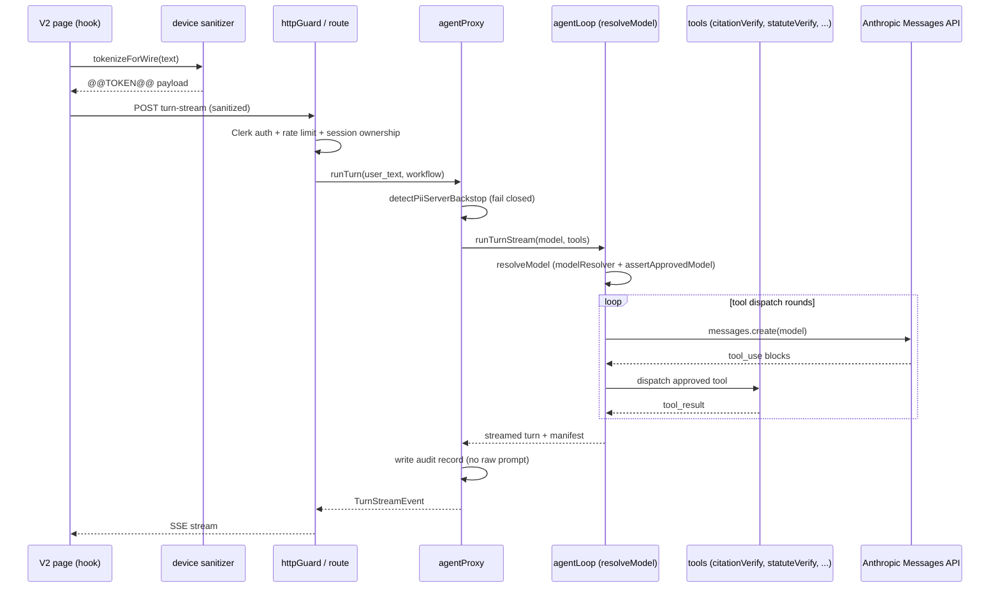

# Architecture overview

## Product identity and surfaces

The product is **AskPauli** (renamed from California Law Chatbot on 2026-07-22), built for Femme & Femme LLP, a California family-law / LGBTQ+ practice. It has two deployment surfaces that share one Anthropic-direct agent engine and one React front end:

- **Web** (`app.askpauli.com`, Vercel auto-deploy from `main`): Clerk auth, Vercel serverless functions, session/matter state in Upstash Redis, optional blob storage for chat payloads.
- **Desktop** (notarized Tauri 2 `AskPauli.app`): a loopback-only sidecar (`desktop-server.mjs`) serves the built front end and the full V2 agent-loop API on `127.0.0.1:8477`. Sessions, tool-result cache, locks, rate-limit counters, and audit records live in per-user SQLite under `~/Library/Application Support/AskPauli/sessions.db` and never leave the machine. `desktop-env.mjs` deletes Upstash/Blob credentials at boot so any missed cloud path fails closed instead of silently writing off-device.

## System shape

The repository is split into a React SPA and a server surface that runs either as Vercel serverless functions (web) or a bundled Express sidecar (desktop).

- `index.tsx` boots React, Clerk, and routing.
- `App.tsx` is the root router and mounts the single production front end.
- `api/` contains the serverless surface and most of the trust boundary logic.
- `services/` and `hooks/` hold client-side sanitization, stream handling, and workspace helpers.
- `agents/` provides system prompts and skill markdown for the V2 agent loop.

The current architecture is intentionally single-line: the app redirects root and legacy paths into `/v2`, and the V2 surfaces are the only active UI paths in `App.tsx`.

## Request flow

1. A signed-in user interacts with a V2 page.
2. The page calls `useV2AgentStream`, `useV2VerifyStream`, or a related hook.
3. The hook tokenizes text on the device using `services/sanitization/chatAdapter.ts` and `services/sanitization/detectionPipeline.ts`.
4. The request is sent to a Vercel route such as `api/agent/turn-stream.ts` (or the same handler mounted on the desktop sidecar).
5. The server authenticates with Clerk via `api/_lib/httpGuard.ts` and `utils/auth.ts` (web only; desktop uses the dev-user bypass since the sidecar is loopback-only).
6. The policy engine decides which tools, models, disclosures, and review gates are allowed.
7. `agentProxy.ts` runs a server-side regex PII backstop, then `agentLoop.ts` resolves the active model (`resolveModel`) and dispatches approved tools, recording a turn manifest and audit trail.
8. Results stream back to the UI for rendering.

The diagram above shows one V2 turn from device tokenization through policy-gated model resolution and tool dispatch to the streamed response. The same path runs on web (Vercel) and desktop (sidecar); only the auth step differs.

## Server side trust boundary

The important boundary is inside `api/_lib/`.

### Authentication and route security

- `api/_lib/httpGuard.ts` centralizes Clerk auth, CORS, session ownership checks, and per-user rate limiting.
- `api/_shared/routeSecurity.ts` applies the hardened response headers and exact-origin allowlist.
- `api/chats.ts` and `api/export-document.ts` show the pattern of applying route security before doing any work.

### Session and persistence model

- `api/_lib/sessionStore.ts` wraps Upstash Redis and defines the session keys for messages, metadata, locks, and idempotency caches.
- `api/matter-context.ts` reads and writes matter mode, client consent, and protected-lock state against session metadata.
- `api/chats.ts` stores legacy chat history and includes a server-side raw-PII backstop before persistence.

### Agent loop and tool execution

- `api/_lib/agentLoop.ts` is the core turn engine and the only code path that talks to Anthropic Messages directly.
- `api/_lib/tools/index.ts` builds the tool registry and dispatches tool use blocks.
- `api/_lib/compliance/toolQueryGuard.ts` and the policy engine prevent tool misuse and exfiltration.
- `api/_lib/compliance/turnManifest.ts` records a structured per-turn compliance manifest.
- `api/_lib/tools/citationVerify.ts` implements the two-provider case-citation identity gate (CiteLaw structured check plus CourtListener search evidence); `api/_lib/tools/statuteVerify.ts` verifies statutory/regulatory citations against official sources. The verification SSE route (`api/agent/verify-stream.ts`) prefetches CiteLaw once for all case citations, caches results for six hours, then runs one verifier sub-agent per citation. The Drafting Magic QC route (`api/agent/draft-qc.ts`) runs the same verifier section-by-section with a 15-citation/run cap and emits a `partial` status for over-cap/errored sections. See [workflows](workflows.md) for the user-facing flow and status semantics.
- Citation verification is mandated by the core skill (`agents/california-legal/skills/california-legal-core.md`): before any case citation appears in a final answer the agent must run `citation_verify` in that turn; if the tool abstains or errors, the citation must be omitted or explicitly labeled UNVERIFIED. Quick mode (`agentLoop.ts` quick-mode prompt) runs no tools and must label every memory citation UNVERIFIED, pointing the attorney to the Verify tab.

### Compliance layer

`api/_lib/compliance/policyEngine.ts` is the main server-authoritative policy decision point. It decides:

- effective matter mode
- whether external calls are allowed
- tokenization level
- allowed and blocked tools
- required disclosures
- required review gates
- evidence sinks and blocking reasons

Related modules refine that policy with governance, conflict checks, billing, review gates, and storage rules.

### Model selection and the approved-model guard

Model selection is automatic and fail-closed:

- `api/_lib/modelResolver.ts` fires one background Anthropic Models-API call on module load and caches the newest `created_at` id in each approved family (Fable primary, Opus unavailability failover, Sonnet quick-mode + verifier). Getters (`latestPrimary`, `latestFallback`, `latestFast`) are synchronous cache reads that return pinned `KNOWN_GOOD` defaults until the first resolution lands or if it ever fails, so a Models-API outage can never break a turn. The cache self-refreshes lazily after six hours; preview/mythos surfaces are always excluded.
- `api/_lib/approvedModels.ts` is the fail-closed gate. `assertApprovedModel` throws before any Anthropic request carrying client content if the resolved id is outside the `claude-(fable|opus|sonnet|haiku)-*` families or contains `preview`/`mythos`. An env override (`V2_PRIMARY_MODEL` / `V2_FALLBACK_MODEL`) can never introduce an unreviewed model because `resolveModel` in `agentLoop.ts` calls `assertApprovedModel` on the final id on the create, stream, and failover-retry paths.
- Unavailability failover is in-process only: `agentLoop.ts` keeps a process-lifetime `unavailableModels` set and swaps a known-unavailable primary for the Opus fallback (never a cross-provider fallback), then asserts the final model again. `stop_reason='refusal'` is surfaced, never retried. The citation verifier sub-agent (`api/_lib/verifierSubAgent.ts`) separately resolves the newest Sonnet via `latestFast` (env override: `V2_VERIFIER_MODEL`).

Adding a model is a compliance event, not a code-only change: update the provider-registry evidence and disclosure copy if vendor terms for the model differ, and record counsel sign-off (see `docs/PRD_COPRAC_ZDR_COMPLIANCE.md` §5.8).

## Client sanitization pipeline

The app uses an on-device privacy filter rather than trusting server-side redaction alone.

- `hooks/useSanitizer.tsx` initializes the active sanitizer.
- `services/sanitization/detectionPipeline.ts` combines OPF detection, regex patterns, allowlist suppression, and denylist logic. When overlapping spans disagree on category, deterministic regex-pattern spans (SSN, driver license, credit card, etc.) outrank OPF spans; when categories agree, the longer span wins as before.
- `services/sanitization/realSanitizer.ts` performs tokenize/rehydrate operations and maintains the in-memory token map.
- `services/sanitization/chatAdapter.ts` is the client-facing abstraction used by the V2 hooks.

The key design choice is fail-closed tokenization for wire traffic. If sanitization is unavailable on supported devices, the send path should block rather than leak raw text.

## UI architecture

`App.tsx` routes the signed-in shell to four active V2 surfaces:

- `/v2` — chat / research
- `/v2/draft` — document editing and proposal workflow
- `/v2/verify` — citation verification
- `/v2/magic` — Drafting Magic packet workflow

`components/v2/V2Sidebar.tsx` provides navigation. The V2 pages are intentionally separate so each workflow can evolve independently while sharing the same sanitizer and agent stream infrastructure.

### Unverified-citation visibility invariant

An unchecked citation must never render indistinguishable from a checked one. This invariant is enforced across all four surfaces through a shared client heuristic and per-surface render rules:

- `utils/citationHeuristic.ts` exports `hasCitationLikeText(text)` — a deliberately permissive regex detector for California case reporters (`123 Cal.App.4th 456`, `550 U.S. 544`, `98 Cal.Rptr.3d 22`, …) and statutes (`Fam. Code § 2030`, `Code Civ. Proc. § 128.5`, `Cal. Rules of Court, rule 5.92`). It is a disclosure gate only and must never be used for verification; the server-side `extractCitations`/`extractStatuteCitations` own parsing.
- `services/guardrailsServiceV2.ts` `checkAnswer(answerText, sources)` runs pre-render on every completed assistant bubble. It warns when a case caption (`X v. Y`) is absent from the source summaries, and now also warns when the answer contains bare reporter/statute cites with zero attached sources (gated by `hasCitationLikeText`). The warning renders as an amber chip below the bubble; it is informational, not a hard gate.
- The chat sources panel (`SourcesPanel` in `V2ChatPage.tsx`) colors per-source status: `verified` → green, `not_found` → red, and abstentions (`unconfirmed`/`unverified`/`unavailable`) → amber "verify manually" — an abstention must never collapse into gray.
- The Draft editor (`V2DraftPage.tsx`) shows a standing amber banner linking to `/v2/verify` whenever the document body matches `hasCitationLikeText`, because that surface runs no verification itself.
- Drafting Magic QC (`api/agent/draft-qc.ts` + `hooks/useV2DraftQC.ts`) adds a `partial` per-section status for sections with unchecked citations (over the 15-per-run cap or verifier errors), rendered as an amber "Partially checked — N unverified" badge instead of the green "Citations verified" shield. See [workflows](workflows.md) for the per-surface flows.

## Data and storage

State is spread across stores that differ by surface:

- browser storage / IndexedDB for sanitization token maps and local UX state (both surfaces)
- browser `localStorage` + IndexedDB for V2 Draft sessions and version chains: draft session snapshots (`utils/draftSessionStore.ts`) and the immutable per-session version chain (`utils/draftVersionStore.ts`) are AES-GCM encrypted at rest via `services/workspaceCrypto.ts` and never sent to cloud KV. See [draft versioning and redline](draft-versioning.md).
- web: Upstash Redis for sessions, metadata, locks, idempotency caches, rate-limit counters, and audit-related state; optional blob storage for chat payload persistence in `api/chats.ts`
- desktop: per-user SQLite at `~/Library/Application Support/AskPauli/sessions.db` (`api/_lib/desktop/sqliteKv.ts`), injected via `setSessionRedis`/`setAuditSink` at sidecar boot so `sessionStore.ts` and its callers are unchanged. The legacy `/api/chats` Blob route is not mounted on desktop; the V2 UI persists chats in IndexedDB instead.

`desktop-env.mjs` is the local-only guardrail: it must be the first import of `desktop-server.mjs` (ESM evaluates imports in order) so env loading and the deletion of Upstash/Blob credentials happen before any API handler module is evaluated. It also one-time-migrates the pre-rename "California Law Chatbot" app-support directory to "AskPauli". Document export uses browser-side generation in some flows and a server export route in others, depending on the workflow.

## Historical context

The repository history shows a deliberate migration from an older OpenRouter/Gemini-era app to a single Anthropic-direct V2/V4 line. Several deleted files and historical docs in `README.md` and `docs/archive-v1/` are now reference-only.
e-v1/` are now reference-only.
