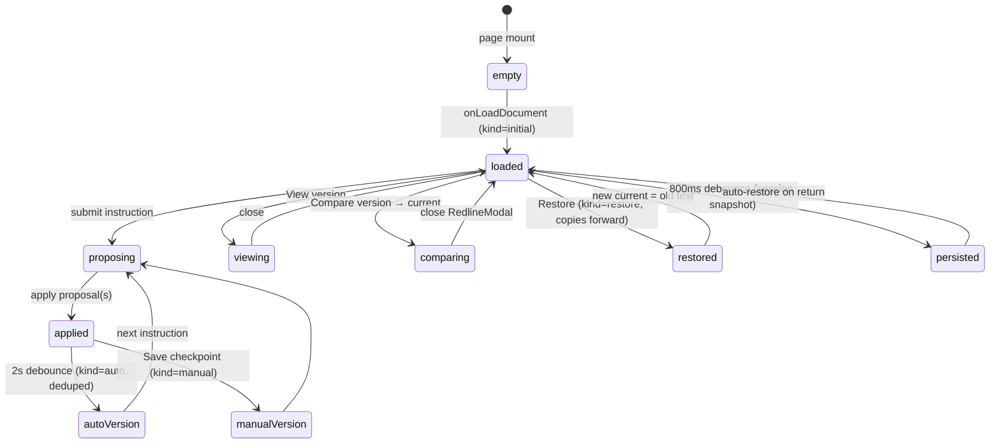

# Draft versioning and redline

The V2 Draft page (`/v2/draft`) ships a Word-style version history and a lawyer-readable redline compare. This subsystem was added in two phases at commit `ed1209b` ("Draft versioning phase 2: word-level redline compare"):

- **Phase 1** — an immutable per-session version chain persisted in encrypted IndexedDB, with a panel for viewing, restoring, and labeling versions.
- **Phase 2** — word-level redline comparison between any saved version and the current document, rendered as insertions (blue underline) and deletions (red strikethrough).

A companion change added **device-local encrypted draft session persistence** so navigating away from `/v2/draft` no longer destroys the document and edit history, plus **proposal-parsing recovery** for `max_tokens`-truncated model replies. All four pieces share the same device-local encryption posture and never send client documents to cloud KV.

## Why this exists

Before this subsystem, the Draft page had no history: every applied proposal silently mutated the document, a bad edit could not be rolled back, and navigating away lost everything. The version chain makes every change auditable and recoverable; the redline gives an attorney a reviewable, word-level diff before accepting or restoring a version; session persistence makes the page survive navigation. Proposal parsing was extracted and hardened after a production incident where a truncated reply dumped raw JSON at the attorney.

## Data model

### DraftVersion (`utils/draftVersionStore.ts`)

One record per version, keyed `<sessionId>:<paddedVersionNumber>` in IndexedDB (`db: v2-draft-versions`, `store: versions`). The payload is AES-GCM encrypted at rest via `services/workspaceCrypto.ts`.

| Field | Type | Meaning |
|---|---|---|
| `session_id` | `string` | Partition key; matches the Draft session id. |
| `version` | `number` | 1-based, strictly increasing within a session (`nextVersionNumber` uses `max`, not `count`, so pruned chains keep numbering monotonic). |
| `savedAt` | `string` (ISO) | Creation timestamp. |
| `kind` | `DraftVersionKind` | `'initial'` \| `'auto'` \| `'manual'` \| `'restore'` — drives retention and panel labels. |
| `label` | `string?` | Optional user label ("sent to opposing counsel"). |
| `proposals` | `VersionAttribution[]` | Proposals applied since the previous version (empty for `initial`/`manual`). Each entry is `{section, description}`. |
| `documentText` | `string` | Full document text at this version (omitted from `DraftVersionMeta` until viewed). |
| `wordDelta` | `number` | Word-count delta vs the previous version (insertions positive). |
| `restoredFrom` | `number?` | For `kind: 'restore'`, the version number that was restored. |

### Version kinds and retention

- `'initial'` — the document as first loaded (`appendVersion` call in `V2DraftPage.tsx` `onLoadDocument`).
- `'auto'` — cut 2s after the document settles following applied proposals (debounced effect); `appendVersion` dedupes identical text so no-op saves never create empty versions.
- `'manual'` — an explicit user checkpoint with an optional label (`onSaveVersion`).
- `'restore'` — a restore copies the old version forward as a **new** version; history is never destroyed.

Retention is pure logic in `planPrune` (unit-tested, no browser needed): `MAX_VERSIONS_PER_SESSION = 50`; when over, the oldest `'auto'` versions are pruned first. `'initial'`, `'manual'`, and `'restore'` versions are **never** auto-pruned. If protected versions alone exceed the cap, nothing beyond the auto versions is pruned — history is precious.

### RedlineOp (`utils/draftRedline.ts`)

A flat op list consumed by the `RedlineModal` component (and, per the module header, a future phase-3 tracked-changes DOCX exporter):

```ts
type RedlineOpType = 'equal' | 'ins' | 'del';
interface RedlineOp { type: RedlineOpType; text: string; }
interface RedlineStats { insertedWords: number; deletedWords: number; identical: boolean; }
```

### ProposedChange (`utils/draftProposals.ts`)

```ts
interface ProposedChange { section: string; description: string; rationale: string; find: string; replace: string; }
```

The model replies with `{"changes":[{section,description,rationale,find,replace}…]}`. `parseChangesJson` handles complete replies (with optional ```json fences and surrounding prose); `salvageChanges` recovers every complete proposal from a `max_tokens`-truncated reply by scanning the changes array and JSON-parsing each balanced `{…}` chunk individually (string/escape aware). A proposal without a non-empty `find` is dropped as unusable.

### DraftSessionSnapshot (`utils/draftSessionStore.ts`)

Persisted to `window.localStorage` under `v2-draft:session:<id>` (encrypted); a plaintext index at `v2-draft:index` holds `{id, title, savedAt}`. Retention: newest 20 sessions. The snapshot holds `documentText`, `history` (instruction + proposals per turn), and `uploadedName`. Auto-saves on an 800ms debounce after meaningful changes; the most recent session auto-restores on page return.

## Lifecycle



The diagram shows the version lifecycle from document load through proposal application, auto/manual version cuts, view/compare/restore, and session persistence. Restores never destroy history — they append a new `'restore'` version whose `documentText` is the old version's text.

## Invariants

1. **Append-only chain.** `appendVersion` never overwrites or deletes a version in place (except auto-prune of oldest `'auto'` versions over the cap). Restore copies forward.
2. **Monotonic numbering.** `nextVersionNumber` returns `max(existing versions) + 1`, so pruned chains keep numbers strictly increasing.
3. **No empty versions.** For `'auto'` and `'initial'`, `appendVersion` returns `null` when the text is identical to the latest version. `'manual'` and `'restore'` always append so every deliberate checkpoint/restore is visible.
4. **Protected kinds survive pruning.** `planPrune` only ever returns `'auto'` version numbers; `'initial'`, `'manual'`, `'restore'` are never pruned.
5. **Redline reconstruction.** `equal + del` ops reproduce the old text exactly; `equal + ins` ops reproduce the new text exactly. A redline that doesn't reconstruct both sides is lying about the documents.
6. **Word-boundary readability.** An in-word edit (`"Arjun" → "Arjuna"`) renders both whole words (`[-Arjun-]{+Arjuna+}`), never a bare inserted letter. `snapToWordBoundaries` widens any ins/del whose edges fall mid-word to the whole word, re-emitting the fragment on both sides.
7. **Device-local encryption.** Version payloads and draft sessions are AES-GCM encrypted at rest via the same non-extractable device-local key as Drafting Magic (`services/workspaceCrypto.ts`). Nothing ever leaves the device.
8. **Truncation recovery.** `salvageChanges` recovers every complete proposal from a `max_tokens`-truncated reply; a proposal missing a usable `find` is dropped.

## Source files and symbols

- `utils/draftVersionStore.ts` — `appendVersion`, `listVersions`, `loadVersion`, `deleteVersionsForSession`, `planPrune`, `nextVersionNumber`, `countWords`, `wordDelta`, `MAX_VERSIONS_PER_SESSION`, `DraftVersion`, `DraftVersionKind`, `VersionAttribution`.
- `utils/draftRedline.ts` — `computeRedline`, `snapToWordBoundaries`, `RedlineOp`, `RedlineStats`.
- `utils/draftProposals.ts` — `parseChangesJson`, `salvageChanges`, `ProposedChange`.
- `utils/draftSessionStore.ts` — `saveDraftSession`, `loadDraftSession`, `deleteDraftSession`, `listDraftSessions`, `latestDraftSessionId`, `draftTitle`, `DraftSessionSnapshot`.
- `components/v2/V2DraftPage.tsx` — `VersionsPanel`, `RedlineModal`, `VERSION_KIND_LABEL`, `onViewVersion` / `onCompareVersion` / `onRestoreVersion` / `onSaveVersion` handlers, auto-version debounce effect, session restore effect.
- `services/workspaceCrypto.ts` — `encryptWorkspace`, `decryptWorkspace`, `isEncrypted` (shared device-local key; see [architecture](architecture.md)).

## Focused tests

- `tests/draft-version-store.test.mjs` (`yarn test:draft-versions`) — pure logic: `countWords`, `wordDelta`, `nextVersionNumber` (uses max not count), `planPrune` (under cap → no prune; over cap by N → prune exactly N oldest autos; manual/initial/restore protected; all-protected over cap → prune nothing). IndexedDB/crypto plumbing is exercised by the Playwright browser E2E, not here (Node has no IndexedDB).
- `tests/draft-redline.test.mjs` (`yarn test:draft-redline`) — reconstruction invariant over a corpus of edits (old side and new side rebuild exactly), word-boundary readability (`Arjun→Arjuna` shows whole words, `fourteen→thirty` keeps words whole, mid-word `runing→running` shows whole words), pure-insertion cleanliness, and stats counting.
- `tests/draft-proposal-parsing.test.mjs` (`yarn test:draft-proposals`) — strict parse of complete/fenced/prose-wrapped JSON, salvage from a truncated reply (recovers complete changes), escaped quotes + braces inside strings, drop proposals without a usable `find`, degenerate inputs.

## Change guidance

### Adding a new version kind or changing retention

1. Extend `DraftVersionKind` in `utils/draftVersionStore.ts` and decide whether it is protected (never pruned) or auto-prunable.
2. Update `planPrune`'s filter and the `VERSION_KIND_LABEL` map in `V2DraftPage.tsx`.
3. Add cases to `tests/draft-version-store.test.mjs` covering: under cap, over cap with the new kind, all-protected over cap.
4. Run `yarn test:draft-versions`.

### Changing the redline engine or word-boundary snapping

1. Edit `computeRedline` or `snapToWordBoundaries` in `utils/draftRedline.ts`.
2. The reconstruction invariant is the non-negotiable contract: add a case to `tests/draft-redline.test.mjs` `CASES` array and confirm both `oldSide(ops) === a` and `newSide(ops) === b`.
3. Add a word-boundary readability case if the change affects snapping.
4. Run `yarn test:draft-redline`.

### Changing proposal parsing

1. Edit `parseChangesJson` / `salvageChanges` in `utils/draftProposals.ts`.
2. Add a truncation/escape case to `tests/draft-proposal-parsing.test.mjs`.
3. Run `yarn test:draft-proposals`.
4. If the proposal shape changes, update `VersionAttribution` and the `V2DraftPage.tsx` proposal-application path that drains `pendingAttributionRef` into the next auto version.

### Changing session persistence

1. Edit `utils/draftSessionStore.ts`. Note the snapshot `version: 1` field — bump it and add a migration in `loadDraftSession` if the shape changes.
2. The IndexedDB-backed version store (`draftVersionStore.ts`) is separate from the localStorage-backed session store (`draftSessionStore.ts`); deleting a draft session calls `deleteVersionsForSession` to remove its whole chain.
3. Both stores share `services/workspaceCrypto.ts`; changing the encryption scheme affects Drafting Magic too (see [architecture](architecture.md)).

## Scope boundaries

- The version store uses IndexedDB (not localStorage) because 50 versions of a long agreement would blow localStorage's ~5MB cap. The session store uses localStorage because a single snapshot is small.
- The redline output is consumed only by `RedlineModal` today; the module header notes a future phase-3 tracked-changes DOCX exporter is not yet implemented.
- Proposal parsing is pure (no file I/O); the IndexedDB/crypto plumbing in the version store is not unit-tested in Node (no IndexedDB) — it is covered by the Playwright browser E2E battery.
- This subsystem is intentionally separate from the cloud `sessionStore.ts` used by chat: client documents deliberately do not sit in cloud KV.
