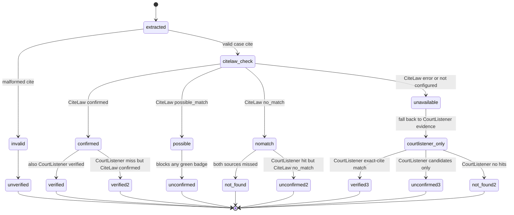

# Workflows

## 1. Research chat

Primary surface: `components/v2/V2ChatPage.tsx`.

This is the main attorney-facing interaction model:

- a session id is created or restored
- the user asks a legal question
- the page streams a turn from `useV2AgentStream`
- the UI shows sanitization status, tool affordances, streamed text, and final turn summaries
- after streaming completes, `checkAnswer` (in `services/guardrailsServiceV2.ts`) runs a pre-render guardrail on the assistant bubble and surfaces an amber warning chip when the answer cites case captions or citation-shaped text (`hasCitationLikeText`) with no attached sources
- the sources panel (`SourcesPanel` in `V2ChatPage.tsx`) colors per-source status: `verified` green, `not_found` red, and abstentions (`unconfirmed`/`unverified`/`unavailable`) amber "verify manually"

Quick mode (`useV2AgentStream` quick flag) runs no tools: the agent answers directly from memory and must label every citation UNVERIFIED, directing the attorney to the Verify tab. The guardrail's zero-sources warning fires in this mode whenever the answer contains citation-shaped text.

Useful source files:

- `components/v2/V2ChatPage.tsx`
- `hooks/useV2AgentStream.ts`
- `services/guardrailsServiceV2.ts` (`checkAnswer` pre-render guardrail)
- `utils/citationHeuristic.ts` (`hasCitationLikeText` disclosure gate)
- `api/agent/turn-stream.ts`
- `api/_lib/agentLoop.ts`
- `api/_lib/tools/index.ts`

Watch-outs:

- The page depends on device-side sanitization being ready before sending sensitive text.
- The stream client must preserve turn/session ownership to avoid cross-session leakage.
- Tool availability is policy-driven, not purely UI-driven.
- `checkAnswer` is informational, not a hard gate; the core-skill mandate (`citation_verify` before any case citation in a final answer) is the authoritative discipline, enforced by prompt, not by code.

## 2. Draft document workflow

Primary surface: `components/v2/V2DraftPage.tsx`.

This workflow lets a user load an existing document, describe edits, and receive discrete proposed changes rather than a silent rewrite. The UI is built around reviewable edit proposals.

Useful source files:

- `components/v2/V2DraftPage.tsx`
- `hooks/useV2AgentStream.ts`
- `services/sanitization/chatAdapter.ts`
- `services/sanitization/wireGuard.ts`
- `components/v2/V2DraftingMagicPage.tsx` for the higher-complexity drafting flow

Watch-outs:

- The prompt contract expects structured JSON output with atomic changes.
- File ingestion happens in-browser. The Draft page has its own drop zone that reads dropped files via the same path as the upload button; a window-level guard in `App.tsx` prevents drops outside that zone from navigating the browser away from the SPA.
- Sanitization applies to the full payload before it leaves the device.
- Draft/export behavior is split between browser generation and server export, so confirm which path a change uses.
- This editor runs no citation verification at all. Whenever the document body contains citation-shaped text (`hasCitationLikeText` in `utils/citationHeuristic.ts`), the page shows a standing amber banner — "Citations in this document are not verified" — linking to `/v2/verify`. An unchecked citation must never render indistinguishable from a checked one on this surface.

## 3. Citation verification workflow

Primary surface: `components/v2/V2VerifyPage.tsx`.

The verification page is a focused workflow for pasting legal text and checking citations against the verification sub-agent. It exposes per-citation verdicts and summary counts.

Case verification uses a two-provider identity gate implemented in `api/_lib/tools/citationVerify.ts`:

- **CiteLaw** (`CITELAW_API_KEY`, endpoint `https://citelaw.org/api/v1/citations/verify`) receives only the public reporter citation, case caption, and decision year in one batch. Its `confirmed`, `possible_match`, and `no_match` result is preserved in the per-citation `citelaw` field (`CiteLawCitationVerification`). A missing key yields batch `citelaw.status = 'not_configured'`; provider errors yield `unavailable` and fall back to CourtListener.
- **CourtListener** (`COURTLISTENER_API_KEY`, `api/_lib/tools/courtlistenerSearch.ts`) supplies independent search and opinion-record evidence; `applyCiteLawIdentityGate` keeps the raw `courtlistener_status` alongside the gated `status`.
- The `verify-stream` route prefetches CiteLaw once for all case citations (`prefetchCiteLawVerification`) and caches structured results for six hours (`CITELAW_CACHE_TTL_MS`, max 1,000 entries) before running one sub-agent per citation, so the provider's one-credit minimum is charged once per batch rather than per row. The final `done` summary reports `credits_charged` and `credits_remaining`.

The diagram above shows how CiteLaw's structured result gates the final per-citation status. A CiteLaw `confirmed` upgrades to `verified`; a `possible_match` or a `no_match` against a CourtListener hit forces `unconfirmed`, blocking a CourtListener-only green badge. Provider outages degrade to CourtListener-only and surface as `unavailable`, never as fabricated.

Useful source files:

- `components/v2/V2VerifyPage.tsx`
- `hooks/useV2VerifyStream.ts`
- `api/agent/verify-stream.ts`
- `api/_lib/tools/citationVerify.ts`
- `api/_lib/verifierSubAgent.ts`
- `api/_lib/tools/statuteVerify.ts`
- `api/_lib/tools/courtlistenerSearch.ts`

Watch-outs:

- The workflow is intentionally narrower than the main chat surface.
- The verifier is about citations and public law sources, not client-confidential matter work.
- Status labels distinguish `verified`, `unconfirmed`, `not_found`, `unverified`, and `unavailable`; only `verified` is positive evidence. `not_found` is a corpus miss, not standalone proof of fabrication; `unavailable` must never be treated as evidence a case is fake.
- The same status set is rendered in the chat sources panel (see [Research chat](#1-research-chat)) where abstentions get an amber "verify manually" badge and `not_found` turns red, so an unchecked citation never looks checked. The Drafting Magic QC loop (see [Drafting Magic workflow](#4-drafting-magic-workflow)) reuses the same verifier with a 15-citation/run cap and a `partial` status for unchecked sections.
- The core skill makes `citation_verify` mandatory before any case citation appears in a final answer; an abstain/error/`unavailable` result must be omitted or explicitly labeled UNVERIFIED. This is prompt-enforced discipline layered on top of the structured status taxonomy here.
- Sub-agent runs are sequential (~18s/citation median) to avoid saturating the Anthropic rate limit; the endpoint caps at 20 citations per request and reports any skipped count.

## 4. Drafting Magic workflow

Primary surface: `components/v2/V2DraftingMagicPage.tsx`.

This is the most complex V2 surface. It combines source ingestion, packet comparison, drafting guidance, sanitization, and export-like behaviors into a guided document-generation experience.

After a draft is generated, the surface runs an automatic citation-QC pass (`api/agent/draft-qc.ts` + `hooks/useV2DraftQC.ts`): for each named section it extracts case and statute citations, verifies each through the same citation-verifier sub-agent behind `/v2/verify`, and streams per-citation verdicts tagged with their section id. The per-run cap is **15 citations** (`MAX_CITATIONS`); citations over the cap or that errored are counted as unchecked and reported in the `summary.skipped` field, never silently dropped. Each section resolves to one of:

- `no_citations` — nothing to check
- `clean` — all citations verified, no issues (green "Citations verified" shield)
- `flagged` — at least one `fake`/`ambiguous` verdict (amber "N citation issues" badge)
- `partial` — some citations were never adjudicated (over cap or verifier errored), even if no issue was found (amber "Partially checked — N unverified" badge)

The `partial` status is the key unverified-citation visibility rule on this surface: a section with unchecked citations must never show the green "Citations verified" shield. The client offers a "Fix flagged" action that regenerates only flagged sections (flag-by-key → revise-only-flagged loop).

Useful source files:

- `components/v2/V2DraftingMagicPage.tsx`
- `hooks/useV2DraftingMagicStream.ts`
- `api/agent/draft-qc.ts` + `hooks/useV2DraftQC.ts` (citation-QC loop)
- `services/sanitization/chatAdapter.ts`
- `services/workspaceCrypto.ts`
- files under `components/draftingMagic/`

Watch-outs:

- There is a custom markdown parser for streamed sections.
- Packet/workspace state can be encrypted locally.
- The page depends on shared sanitization behavior and local token maps.
- This is a good place to inspect when changing document generation or packet comparison logic.
- QC section-status arithmetic (citation_count − checked + errored > 0 ⇒ `partial`, unless issues > 0 ⇒ `flagged`) is mirrored in `tests/unverified-citation-visibility.test.mjs`; keep the test in lockstep if you change `api/agent/draft-qc.ts`'s summary computation.

## 5. Matter mode and consent workflow

Primary surface: `components/v2/MatterModeSelector.tsx` backed by `api/matter-context.ts`.

This workflow records whether a session is public research, client confidential, or protected discovery, and it stores client AI-use consent. The server is the authoritative source of truth.

Useful source files:

- `components/v2/MatterModeSelector.tsx`
- `api/matter-context.ts`
- `api/_lib/compliance/policyEngine.ts`
- `api/_lib/compliance/attestations.ts`
- `api/_lib/sessionStore.ts`

Watch-outs:

- protected discovery is treated as a locked state with downgrade protection.
- consent is not just a UI toggle; it is persisted and used by policy decisions.
- the selector is coupled to session ownership checks.

## 6. Chat storage and export

Related surface: `api/chats.ts` and `api/export-document.ts`.

`api/chats.ts` manages chat CRUD, while `api/export-document.ts` generates DOCX, PDF, or HTML exports from generated documents.

Useful source files:

- `api/chats.ts`
- `api/export-document.ts`
- `api/_lib/httpGuard.ts`
- `api/_shared/routeSecurity.ts`

Watch-outs:

- `api/chats.ts` contains a server-side pre-save PII backstop.
- `api/export-document.ts` requires authentication and rate limiting.
- If you change export or persistence, check route security and auth first.
